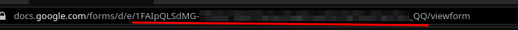
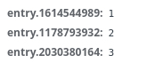

## Описание
Небольшой скрипт на накрутку ответов в Google формах

## Использование
1. Открываем форму
2. Копируем её имя
> 
3. Открываем "Сеть" в инструментах разработчика
4. Заполняем форму
5. Смотрим поля, которые отправились 
> 
6. Пишем следующую команду:
```
python3 autofill.py [--entry/-e <ID поля> <Значение поля>] [--seed/-s <Сид>] [--count/-c <Количество ответов>] <Имя формы>
```
Чтобы повторить запрос на предыдущем скрине, можно написать эту команду
```
python3 autofill.py -e 1614544989 1 -e 1178793932 2 -e 2030380164 3 -c 1 1FAIpQLSdMG-(...)_QQ
```

Так же в качестве значения поля вы можете использовать файл, написав
`FILE:filename`. Для каждого запроса оно будет брать следующую строку из файла.

## Ответ сразу на несколько страниц
Если в форме присутствует несколько страниц, то вы можете создать json файл:

```json
{
    "0": {
        "<какое-то поле на первой странице>": "<какое-то значение>"
    },
    "1": {
        "<какое-то поле на второй странице>": ["значение 1", "значение 2", "значение 3"]
    }
}
```

Далее, вместо `--entry` используйте опцию `--import-file`